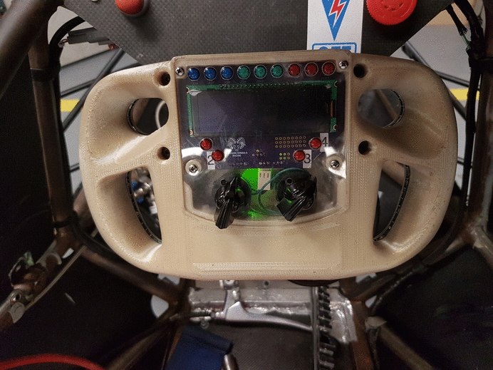

## RF-15 Interactive Steering Wheel Module

The RF-15 interactive steering wheel module was a project that I worked on for Ryerson Formula Racing's 2015 car: the RF-15. The wheel solved the issue of the driver being unaware of how the car was operating during a race; a problem that caused the team to lose two engines in the past. The interactive steering wheel helped us troubleshoot numerous issues for 3 seasons since its creation. It was finally retired in the 2018-2019 season, in favour of a new dash module that is intended to be embedded in the dash of the car.

This project was my first real introduction into multi-layer PCB design, as well as embedded systems software development.

Hover over the image!

**Hardware design**: First revision in EAGLE, second in Altium Designer

**Software design**: Embedded C, programmed in CodeWarrior, later migrated to Kinetis Studio

### Backstory

When I first joined Ryerson Formula Racing in 2014, one of the most major challenges facing the team was data acquisition and processing. The team did have native datalogging capabilities through the Megasquirt 3 Pro, but getting the log data required connecting a laptop to the ECU through USB, and then downloading a log over an annoyingly-slow connection. There was also no engine feedback to the driver during a race. This lack of communication between the vehicle and the driver proved significant, when the engine blew a piston rod through the side of the block due to oil starvation. The oil issue was determined to be caused by an oversight in the design of the oil pan, but had the driver known that the oil pressure was dropping critically low, they would have been able to shut off the car and save the engine.

### Objective

The idea behind the RF-15 steering wheel project was to develop a frictionless interface between the car and the driver. The key design goals were for the module to:
1. Warn the driver of possible issues
2. Display diagnostic information useful during testing
3. Provide gear shift indication to the driver for more efficient shifting

### Features

The resulting steering wheel met all of the design requirements outlined at its conception, and even came in handy in situations that we did not consider at the start. For example, the wheel was an invaluable tool during all test sessions when we needed to watch the engine warm up before pushing the car to its limits. With its 8 configurable display pages, it was very convenient to view sensor values on the wheel instead of requiring a laptop to be connected. In the end, the driver interaction module had the following features:
- 4x20 character OLED display
- 2 8-position selector switches, one which was used to cycle between 8 display pages
- 9 shift light LEDs with switchable colour caps. The shift point could be programmed to specify the exact RPM that the driver should switch at, depending on the current gear
- 4 reconfigurable warning/generic LEDs that could be conveniently configured through the ECU tuning software
- CAN interface for communicating with the ECU
- Prototyping area for development purposes

### Gallery

Coming soon!

